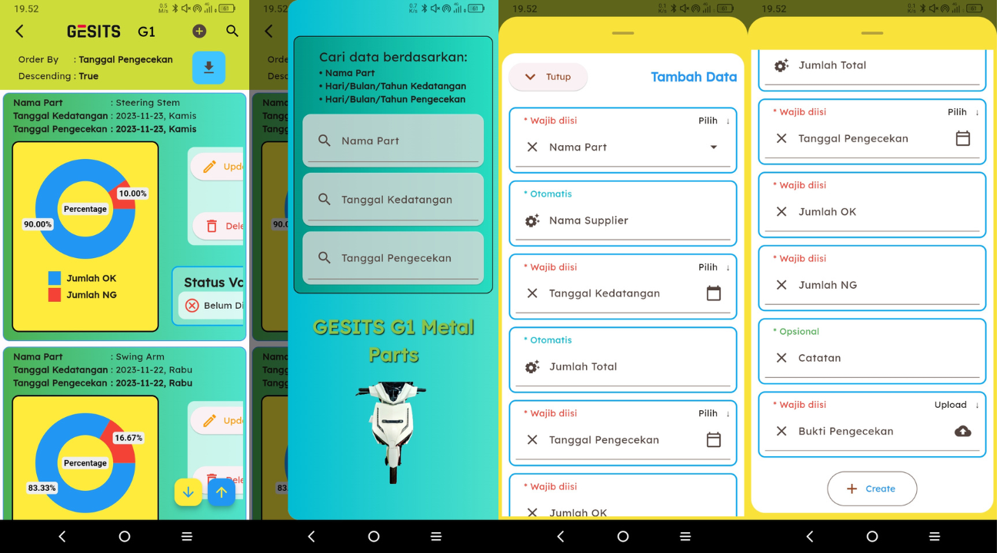

# qc_parts_check

Application for Checking and Archiving GESITS Electric Motorcycle Part Data in the Incoming Area

Download this app: https://drive.google.com/drive/folders/1F4HYUtqOS3b-bjLJmVSWBEQas2z8vcKH?usp=share_link

or

Access from web: https://qc-parts-check.web.app/ or https://qc-parts-check.firebaseapp.com/

Screenshots
-----------

&nbsp;&nbsp;&nbsp;

&nbsp;&nbsp;&nbsp;

&nbsp;&nbsp;&nbsp;

&nbsp;&nbsp;&nbsp;

&nbsp;&nbsp;&nbsp;

&nbsp;&nbsp;&nbsp;

&nbsp;&nbsp;&nbsp;

&nbsp;&nbsp;&nbsp;

&nbsp;&nbsp;&nbsp;

&nbsp;&nbsp;&nbsp;

## Getting Started

This project is a starting point for a Flutter application.

A few resources to get you started if this is your first Flutter project:

- [Lab: Write your first Flutter app](https://docs.flutter.dev/get-started/codelab)
- [Cookbook: Useful Flutter samples](https://docs.flutter.dev/cookbook)

For help getting started with Flutter development, view the
[online documentation](https://docs.flutter.dev/), which offers tutorials, samples, guidance on
mobile development, and a full API reference.
